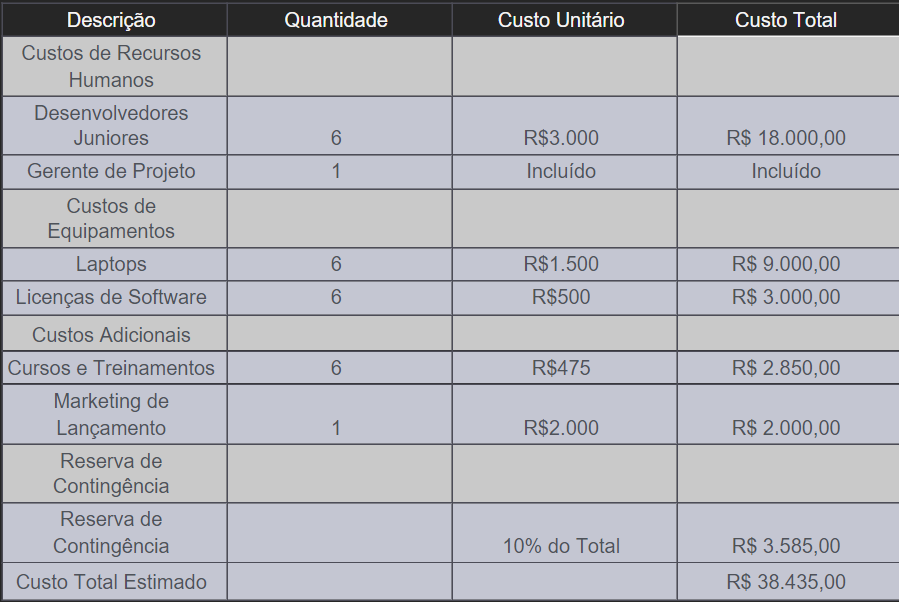

# Especificações do Projeto
A definição exata do problema e os pontos mais relevantes a serem tratados neste projeto foi consolidada com a participação dos usuários em um trabalho de imersão feita pelos membros da equipe a partir da observação dos usuários em seu local natural e por meio de entrevistas. Os detalhes levantados nesse processo foram consolidados na forma de personas e histórias de usuários. 

Personas 
As personas levantadas durante o processo de entendimento do problema são apresentadas na Figuras que se seguem. 

## Personas

## Histórias de Usuários
A partir da compreensão do dia a dia das personas identificadas para o projeto, foram registradas as seguintes histórias de usuários. 

|EU COMO... `PERSONA`| QUERO/PRECISO ... `FUNCIONALIDADE`      |PARA ... `MOTIVO/VALOR`                                             |
|--------------------|-----------------------------------------|--------------------------------------------------------------------|
|Cláudia Rodrigues   | Adquirir mais conhecimento              | Ensinar seus alunos de uma maneira mais completa                   |
|Isadora Almeida     | Emprestar/alugar livros para conhecidos | Para debater opiniões                                              |
|Cláudia Rodrigues   | Adquirir livros infantis                | Praticar a leitura de seu filho                                    |
|Isadora Almeida     | Adquirir livros de autoajuda            | Ajudar a ter uma boa saúde mental e potencial para novas mudanças  |
|Cláudia Rodrigues   | Desapegar de livros velhos              | Conseguir organizar seu armário.                                   |
|Isadora Almeida     | Comprar livros sobre seu curso          | Para conseguir estudar melhor                                      |

## Requisitos do Projeto

O escopo funcional do projeto é definido por meio dos requisitos funcionais que descrevem as possibilidades interação dos usuários, bem como os requisitos não funcionais que descrevem os aspectos que o sistema deverá apresentar de maneira geral. Estes requisitos são apresentados a seguir. 

### Requisitos Funcionais

A tabela a seguir apresenta os requisitos do projeto, identificando a prioridade em que os mesmos devem ser entregues. 

|ID    | Descrição do Requisito  | Prioridade |
|------|-----------------------------------------|----|
|RF-01| O aplicativo deve permitir o cadastro de usuários, portadores de cadastro de pessoa física, onde serão cadastrados, nome completo, CPF, Email, telefone, endereço e um Id. O cadastro também poderá ser efetuado com a conta do Facebook, Apple e Google. | ALTA | 
|RF-02| O aplicativo deve permitir que o usuário cadastrado faça cadastro dos livros com os campos de título, autor, número de páginas, edição, estado de conservação e gênero. O livro cadastrado passa a fazer parte do acervo do usuário.   | ALTA |
|RF-03| O aplicativo deve permitir que o usuário faça a exclusão do cadastro de livros do seu acervo| ALTA | 
|RF-04| O aplicativo deve permitir que o usuário faça a edição do cadastro de livros do seu acervo.    | ALTA |
|RF-05| O aplicativo deve permitir que o usuário oculte/hiberne o cadastro dos livros do seu acervo. | MÉDIA | 
|RF-06| O aplicativo deve permitir que o usuário cadastrado defina quais os tipos de negociação ele aceita sobre os livros que estão no seu acervo: troca ou venda.    | ALTA |
|RF-07| O aplicativo deve oferecer uma funcionalidade de filtro/pesquisa. para permitir ao usuário localizar um livro específico no acervo dos outros usuários cadastrados que será informado na caixa de pesquisa. Os filtros podem ser por título, autor e gênero.  | MÉDIA | 
|RF-08| O aplicativo deve oferecer a visualização dos últimos dez livros cadastrados, por ordem de cadastro.   | MÉDIA |
|RF-09| O aplicativo deve permitir que o usuário cadastrado possa fazer ofertas de negociação (negociar valor e oferecer outro título para troca) nos livros que possuir interesse e aceite ou recuse ofertas de interessados no seu acervo.  | ALTA | 
|RF-10| O aplicativo deve permitir que usuário favorite os livros de interesse, com a criação de uma lista de favoritos.    | BAIXA |

### Requisitos não Funcionais
A tabela a seguir apresenta os requisitos não funcionais que o projeto deverá atender. 

|ID     | Descrição do Requisito  |Prioridade |
|-------|-------------------------|----|
|RNF-01| O aplicativo deve ser intuitivo e de fácil utilização, mesmo para usuários sem experiência técnica.;  | ALTA | 
|RNF-02| O aplicativo deve ser responsivo e funcionar bem em dispositivos móveis de diferentes tamanhos e tablets. |  ALTA | 
|RNF-03| O tempo de carregamento das páginas e a velocidade geral do aplicativo devem ser adequados para proporcionar uma experiência fluida aos usuários.  | MÉDIA | 
|RNF-04| Os dados dos usuários, incluindo informações pessoais e histórico de trocas, devem ser armazenados de forma segura e protegidos contra acessos não autorizados. |  ALTA | 
|RNF-05| O aplicativo deve ser compatível com diferentes sistemas operacionais e dispositivos.  | ALTA | 
|RNF-06| O aplicativo deve cumprir as leis de proteção de dados e privacidade vigentes no país ou região em que opera. |  ALTA | 
|RNF-07| O aplicativo deve ser projetado de forma que atualizações e manutenções possam ser realizadas sem causar interrupções significativas no serviço. | MÉDIA | 

## Restrições

As questões que limitam a execução desse projeto e que se configuram como obrigações claras para o desenvolvimento do projeto em questão são apresentadas na tabela a seguir. 

|ID| Descrição                                            |
|--|-------------------------------------------------------|
|RE-01| O projeto deverá ser entregue no final do semestre letivo, não podendo extrapolar a data de 20/11/23, data de entrega da última etapa do projeto. |
|RE-02| O aplicativo deve ser desenvolvido usando o framework React Native.         |
|RE-03| No início do desenvolvimento o aplicativo não terá ligações externas, a fim de manter o foco e simplificar o processo.        |

## Diagrama de Casos de Uso

O diagrama contempla as principais ligações previstas entre casos de uso e atores e permite detalhar os Requisitos Funcionais identificados na etapa de elicitação. Lembrando que  não se utiliza diagramas de caso de uso para requisitos não-funcionais. 

# Matriz de Rastreabilidade

A matriz de rastreabilidade é uma ferramenta usada para facilitar a visualização dos relacionamento entre requisitos e outros artefatos ou objetos, permitindo a rastreabilidade entre os requisitos e os objetivos de negócio. 

A matriz deve contemplar todos os elementos relevantes que fazem parte do sistema, conforme a figura meramente ilustrativa apresentada a seguir.

> **Links Úteis**:
> - [Artigo Engenharia de Software 13 - Rastreabilidade](https://www.devmedia.com.br/artigo-engenharia-de-software-13-rastreabilidade/12822/)
> - [Verificação da rastreabilidade de requisitos usando a integração do IBM Rational RequisitePro e do IBM ClearQuest Test Manager](https://developer.ibm.com/br/tutorials/requirementstraceabilityverificationusingrrpandcctm/)
> - [IBM Engineering Lifecycle Optimization – Publishing](https://www.ibm.com/br-pt/products/engineering-lifecycle-optimization/publishing/)

# Gerenciamento de Projeto

De acordo com o PMBoK v6 as dez áreas que constituem os pilares para gerenciar projetos, e que caracterizam a multidisciplinaridade envolvida, são: Integração, Escopo, Cronograma (Tempo), Custos, Qualidade, Recursos, Comunicações, Riscos, Aquisições, Partes Interessadas. Para desenvolver projetos um profissional deve se preocupar em gerenciar todas essas dez áreas. Elas se complementam e se relacionam, de tal forma que não se deve apenas examinar uma área de forma estanque. É preciso considerar, por exemplo, que as áreas de Escopo, Cronograma e Custos estão muito relacionadas. Assim, se eu amplio o escopo de um projeto eu posso afetar seu cronograma e seus custos.

## Gerenciamento de Tempo

Com diagramas bem organizados que permitem gerenciar o tempo nos projetos, o gerente de projetos agenda e coordena tarefas dentro de um projeto para estimar o tempo necessário de conclusão.

O gráfico de Gantt ou diagrama de Gantt também é uma ferramenta visual utilizada para controlar e gerenciar o cronograma de atividades de um projeto. Com ele, é possível listar tudo que precisa ser feito para colocar o projeto em prática, dividir em atividades e estimar o tempo necessário para executá-las.

## Gerenciamento de Equipe

O gerenciamento adequado de tarefas contribuirá para que o projeto alcance altos níveis de produtividade. Por isso, é fundamental que ocorra a gestão de tarefas e de pessoas, de modo que os times envolvidos no projeto possam ser facilmente gerenciados. 

## Gestão de Orçamento

O processo de determinar o orçamento do projeto é uma tarefa que depende, além dos produtos (saídas) dos processos anteriores do gerenciamento de custos, também de produtos oferecidos por outros processos de gerenciamento, como o escopo e o tempo.

