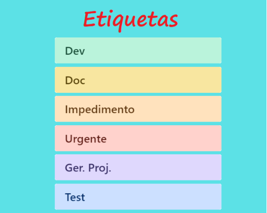

# Especificações do Projeto
A definição exata do problema e os pontos mais relevantes a serem tratados neste projeto foi consolidada com a participação dos usuários em um trabalho de imersão feita pelos membros da equipe a partir da observação dos usuários em seu local natural e por meio de entrevistas. Os detalhes levantados nesse processo foram consolidados na forma de personas e histórias de usuários. 

Personas 
As personas levantadas durante o processo de entendimento do problema são apresentadas na Figuras que se seguem. 

## Personas

## Histórias de Usuários
A partir da compreensão do dia a dia das personas identificadas para o projeto, foram registradas as seguintes histórias de usuários. 

|EU COMO... `PERSONA`| QUERO/PRECISO ... `FUNCIONALIDADE`      |PARA ... `MOTIVO/VALOR`                                             |
|--------------------|-----------------------------------------|--------------------------------------------------------------------|
|Cláudia Rodrigues   | Adquirir mais conhecimento              | Ensinar seus alunos de uma maneira mais completa                   |
|Isadora Almeida     | Emprestar/alugar livros para conhecidos | Para debater opiniões                                              |
|Cláudia Rodrigues   | Adquirir livros infantis                | Praticar a leitura de seu filho                                    |
|Isadora Almeida     | Adquirir livros de autoajuda            | Ajudar a ter uma boa saúde mental e potencial para novas mudanças  |
|Cláudia Rodrigues   | Desapegar de livros velhos              | Conseguir organizar seu armário.                                   |
|Isadora Almeida     | Comprar livros sobre seu curso          | Para conseguir estudar melhor                                      |

## Requisitos do Projeto

O escopo funcional do projeto é definido por meio dos requisitos funcionais que descrevem as possibilidades interação dos usuários, bem como os requisitos não funcionais que descrevem os aspectos que o sistema deverá apresentar de maneira geral. Estes requisitos são apresentados a seguir. 

### Requisitos Funcionais

A tabela a seguir apresenta os requisitos do projeto, identificando a prioridade em que os mesmos devem ser entregues. 

|ID    | Descrição do Requisito  | Prioridade |
|------|-----------------------------------------|----|
|RF-01| O aplicativo deve permitir o cadastro de usuários, portadores de cadastro de pessoa física, onde serão cadastrados, nome completo, CPF, Email, telefone, endereço e um Id. O cadastro também poderá ser efetuado com a conta do Facebook, Apple e Google. | ALTA | 
|RF-02| O aplicativo deve permitir que o usuário cadastrado faça cadastro dos livros com os campos de título, autor, número de páginas, edição, estado de conservação e gênero. O livro cadastrado passa a fazer parte do acervo do usuário.   | ALTA |
|RF-03| O aplicativo deve permitir que o usuário faça a exclusão do cadastro de livros do seu acervo| ALTA | 
|RF-04| O aplicativo deve permitir que o usuário faça a edição do cadastro de livros do seu acervo.    | ALTA |
|RF-05| O aplicativo deve permitir que o usuário oculte/hiberne o cadastro dos livros do seu acervo. | MÉDIA | 
|RF-06| O aplicativo deve permitir que o usuário cadastrado defina quais os tipos de negociação ele aceita sobre os livros que estão no seu acervo: troca ou venda.    | ALTA |
|RF-07| O aplicativo deve oferecer uma funcionalidade de filtro/pesquisa. para permitir ao usuário localizar um livro específico no acervo dos outros usuários cadastrados que será informado na caixa de pesquisa. Os filtros podem ser por título, autor e gênero.  | MÉDIA | 
|RF-08| O aplicativo deve oferecer a visualização dos últimos dez livros cadastrados, por ordem de cadastro.   | MÉDIA |
|RF-09| O aplicativo deve permitir que o usuário cadastrado possa fazer ofertas de negociação (negociar valor e oferecer outro título para troca) nos livros que possuir interesse e aceite ou recuse ofertas de interessados no seu acervo.  | ALTA | 
|RF-10| O aplicativo deve permitir que usuário favorite os livros de interesse, com a criação de uma lista de favoritos.    | BAIXA |

### Requisitos não Funcionais
A tabela a seguir apresenta os requisitos não funcionais que o projeto deverá atender. 

|ID     | Descrição do Requisito  |Prioridade |
|-------|-------------------------|----|
|RNF-01| O aplicativo deve ser intuitivo e de fácil utilização, mesmo para usuários sem experiência técnica.;  | ALTA | 
|RNF-02| O aplicativo deve ser responsivo e funcionar bem em dispositivos móveis de diferentes tamanhos e tablets. |  ALTA | 
|RNF-03| O tempo de carregamento das páginas e a velocidade geral do aplicativo devem ser adequados para proporcionar uma experiência fluida aos usuários.  | MÉDIA | 
|RNF-04| Os dados dos usuários, incluindo informações pessoais e histórico de trocas, devem ser armazenados de forma segura e protegidos contra acessos não autorizados. |  ALTA | 
|RNF-05| O aplicativo deve ser compatível com diferentes sistemas operacionais e dispositivos.  | ALTA | 
|RNF-06| O aplicativo deve cumprir as leis de proteção de dados e privacidade vigentes no país ou região em que opera. |  ALTA | 
|RNF-07| O aplicativo deve ser projetado de forma que atualizações e manutenções possam ser realizadas sem causar interrupções significativas no serviço. | MÉDIA | 

## Restrições

As questões que limitam a execução desse projeto e que se configuram como obrigações claras para o desenvolvimento do projeto em questão são apresentadas na tabela a seguir. 

|ID| Descrição                                            |
|--|-------------------------------------------------------|
|RE-01| O projeto deverá ser entregue no final do semestre letivo, não podendo extrapolar a data de 20/11/23, data de entrega da última etapa do projeto. |
|RE-02| O aplicativo deve ser desenvolvido usando o framework React Native.         |
|RE-03| No início do desenvolvimento o aplicativo não terá ligações externas, a fim de manter o foco e simplificar o processo.        |

## Diagrama de Casos de Uso

O diagrama contempla as principais ligações previstas entre casos de uso e atores e permite detalhar os Requisitos Funcionais identificados na etapa de elicitação. Lembrando que  não se utiliza diagramas de caso de uso para requisitos não-funcionais. 

# Matriz de Rastreabilidade

A matriz de rastreabilidade é uma ferramenta usada para facilitar a visualização dos relacionamento entre requisitos e outros artefatos ou objetos, permitindo a rastreabilidade entre os requisitos e os objetivos de negócio. 

A matriz deve contemplar todos os elementos relevantes que fazem parte do sistema, conforme a figura meramente ilustrativa apresentada a seguir.

> **Links Úteis**:
> - [Artigo Engenharia de Software 13 - Rastreabilidade](https://www.devmedia.com.br/artigo-engenharia-de-software-13-rastreabilidade/12822/)
> - [Verificação da rastreabilidade de requisitos usando a integração do IBM Rational RequisitePro e do IBM ClearQuest Test Manager](https://developer.ibm.com/br/tutorials/requirementstraceabilityverificationusingrrpandcctm/)
> - [IBM Engineering Lifecycle Optimization – Publishing](https://www.ibm.com/br-pt/products/engineering-lifecycle-optimization/publishing/)

# Gerenciamento de Projeto

A equipe utiliza metodologias ágeis, tendo escolhido o Scrum como base para definição do processo de desenvolvimento. 

A equipe está organizada da seguinte maneira: 
Scrum Master: 
* Jonathan Souza

Product Owner: 
* Talita Reis 

Equipe de Desenvolvimento e Designer 
* Jonathan Souza 
* Marcelo Ferreira 
* Rafael Brito 
* Remilton Pereira 
* Renato Freitas 
* Talita Reis 

Para organização e distribuição das tarefas do projeto, a equipe está utilizando o Trello estruturado com as seguintes listas:  

* Recursos: esta lista mantém template de tarefas recorrentes com as configurações padronizadas que todos devem seguir. O objetivo é permitir a cópia destes templates para agilizar a criação de novos cartões. 
* Backlog: recebe as tarefas a serem trabalhadas e representa o Product Backlog. Todas as atividades identificadas no decorrer do projeto também devem ser incorporadas a esta lista. 
* To Do: Esta lista representa o Sprint Backlog. Este é o Sprint atual que estamos trabalhando. 
* Doing: Quando uma tarefa tiver sido iniciada, ela é movida para cá. 
* Test: Checagem de Qualidade. Quando as tarefas são concluídas, eles são movidas para o “CQ”. No final da semana, eu revejo essa lista para garantir que tudo saiu perfeito. 
* Done: nesta lista são colocadas as tarefas que passaram pelos testes e controle de qualidade e estão prontos para ser entregues ao usuário. Não há mais edições ou revisões necessárias, ele está agendado e pronto para a ação. 
* Locked: Quando alguma coisa impede a conclusão da tarefa, ela é movida para esta lista juntamente com um comentário sobre o que está travando a tarefa. 

O quadro kanban do grupo no Trello está disponível através da URL https://trello.com/b/FauLE4j2/app-troca-venda-de-livros e é apresentado, no estado atual, na Figura X. A definição desta estrutura se baseou na proposta feita por Littlefield (2016). 

  
  
Quadro Trello utilizado pela equipe

A tarefas são, ainda, etiquetadas em função da natureza da atividade e seguem o seguinte esquema de cores/categorias: 
* Desenvolvimento 
* Documentação 
* Impedimento 
* Urgente 
* Gerência de Projetos 
* Testes 

## Gerenciamento de Tempo

O objetivo desse plano é desenvolver e lançar a aplicação móvel de venda e troca de livros dentro do prazo estabelecido.  

Atividades:  
* Levantamento de Requisitos 
* Design da Interface 
* Desenvolvimento e Testes 
* Correções e Aprimoramentos 
* Documentação e Lançamento 

Prazo: Início em 21 de Agosto e conclusão em 04 de Dezembro. 

Responsáveis: 
* Jonathan Souza (Desenvolvedor) 
* Marcelo Ferreira (Desenvolvedor) 
* Rafael Brito (Desenvolvedor) 
* Remilton Pereira (Desenvolvedor) 
* Renato Freitas (Desenvolvedor) 
* Talita Reis (Desenvolvedora) 

- Serão realizadas reuniões semanais para atualização de status e identificação de problemas. 
- Uso de ferramentas de gerenciamento de projetos para rastrear o progresso (TRELLO). 
- Atrasos no Desenvolvimento:  
  Reservar duas semanas como buffer no final do cronograma review. 
- Falta de Recursos:  
  Revisar alocamento de recursos regularmente para evitar sobrecargas. 
- Revisões: 
  O cronograma será revisado a cada duas semanas durante as reuniões de status e ajustado conforme necessário. 

O gráfico de Gantt ou diagrama de Gantt também é uma ferramenta visual utilizada para controlar e gerenciar o cronograma de atividades de um projeto. Com ele, é possível listar tudo que precisa ser feito para colocar o projeto em prática, dividir em atividades e estimar o tempo necessário para executá-las.

## Plano de Gerenciamento de Recursos

Este Plano de Gerenciamento de Recursos tem como objetivo garantir que cada membro da equipe tenha papéis e responsabilidades claras, bem como os recursos necessários para executar suas tarefas com eficiência. A colaboração entre os desenvolvedores é fundamental para o sucesso da aplicação móvel de venda e troca de livros. 

Recursos Humanos:  

Atribuições 
- Jonathan Souza (Desenvolvedor): Responsável pelo desenvolvimento backend da aplicação, integração de banco de dados. 
- Marcelo Ferreira (Desenvolvedor): Responsável pelo desenvolvimento frontend da aplicação, design de interface. 
- Rafael Brito (Desenvolvedor): Atuação no desenvolvimento frontend, colaboração no design da interface. 
- Remilton Pereira (Desenvolvedor): Envolvimento no desenvolvimento backend e frontend, foco em usabilidade. 
- Renato Freitas (Desenvolvedor): Contribuição no desenvolvimento backend e frontend, foco em testes. 
- Talita Reis (Desenvolvedora): Participação no desenvolvimento frontend, usabilidade e testes. 

Recursos Tecnológicos: 
- Equipamentos:
Laptops para Desenvolvimento (6 unidades). 
- Softwares:
Licenças de IDEs e Ferramentas de Desenvolvimento:  
- Treinamento e Desenvolvimento:
Cursos Online e Workshops: Custo total fictício. 

Controle e Monitoramento: 
- Reuniões Semanais de Status:  
Monitoramento do progresso das atividades. 
- Uso de Ferramentas de Gerenciamento de Projetos: 
Manter tarefas e prazos atualizados. 

## Gestão de Orçamento*

Duração do Projeto: 21/08/2023 a 04/12/2023 

Custos de Recursos Humanos: 
- 6 Desenvolvedores Juniores: 6 x R$3.000 (Valor mensal de um desenvolvedor junior)  
- Gerente de Projeto: Incluído nas despesas dos desenvolvedores 
##### Total Estimado: R$18.000  

Custos de Equipamentos e Softwares:
- Laptops (6 unidades): R$1.500 por unidade  
- Software de Desenvolvimento (6 licenças): R$500 por desenvolvedor  
##### Total Estimado: R$12.000   

Custos Adicionais:
- Cursos e treinamentos: R$475 por mês por desenvolvedor  
- Marketing de Lançamento: R$2.000  
##### Total Estimado: R$4.850   

Reserva de Contingência:
- 10% do Total Estimado
##### Total Estimado: R$3.585   

#### Custo Total Estimado: R$38.435 

Monitoramento e Controle de Custos:

- Revisar os gastos semanalmente para garantir que estejam alinhados com o orçamento. 
- Qualquer desvio significativo do orçamento deve ser imediatamente comunicado à equipe e tomadas ações corretivas. 

Revisões de Custos:
- O plano de custos será revisado mensalmente para garantir que os gastos reais estejam de acordo com as estimativas. 
- A reserva de contingência será usada apenas em casos de necessidade e com a aprovação do gerente de projeto. 

(*) Para todo esse plano foi considerado uma situação fictícia de valores e funções e recursos. 