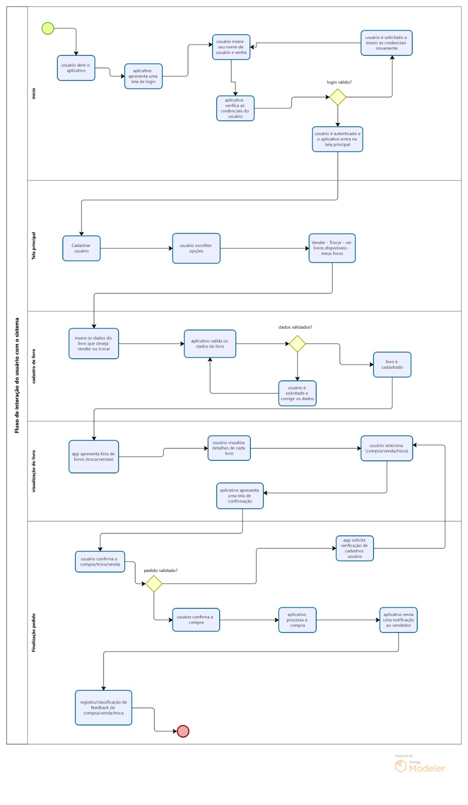
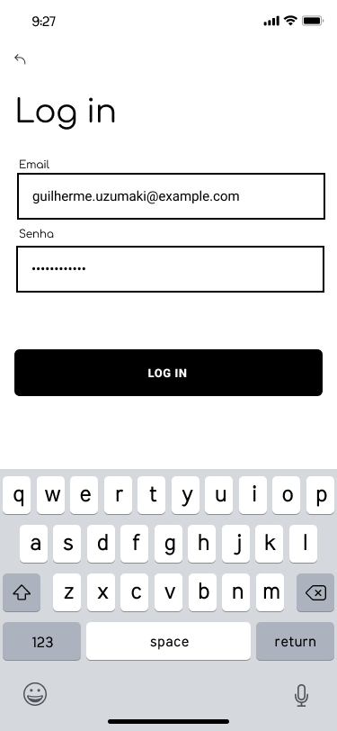
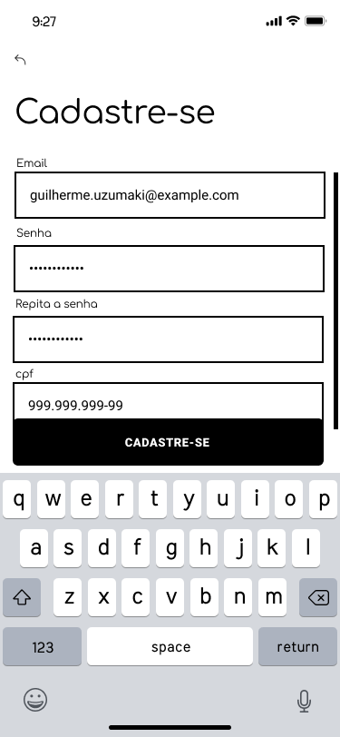
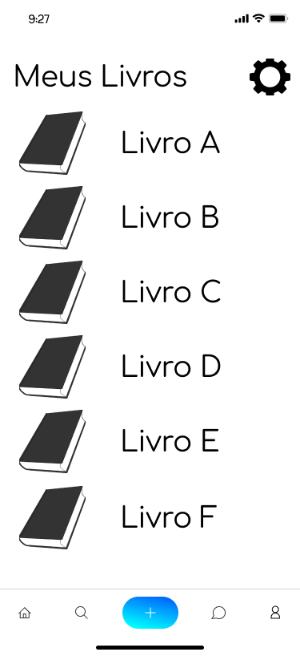
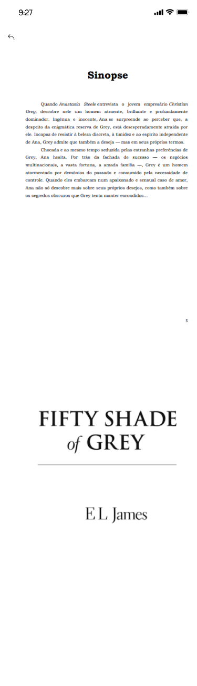
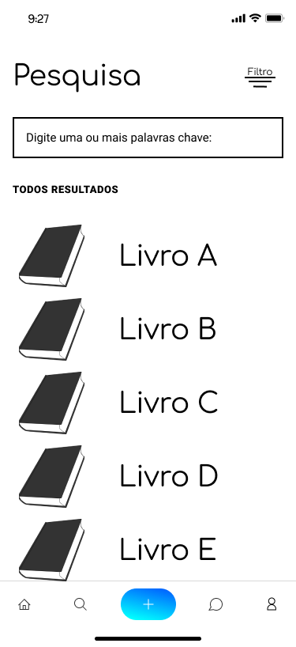

# Projeto de Interface

Pré-requisitos: <a href="2-Especificação do Projeto.md"> Documentação de Especificação</a>

Para atender aos requisitos funcionais e não funcionais do projeto de um aplicativo de venda e troca de livros, é importante criar telas que sejam intuitivas, responsivas e capazes de proporcionar uma experiência fluida aos usuários. Abaixo, descrevo como as telas foram elaboradas para atender a esses requisitos:

1. Tela de Cadastro de Usuário (RF-01):

A tela de cadastro de usuário inclui campos para nome completo, CPF, email, telefone e endereço. Também oferece opções para se cadastrar usando as contas do Facebook, Apple ou Google, proporcionando facilidade de registro.

2. Tela de Cadastro de Livros (RF-02):

Esta tela permite aos usuários cadastrados adicionar livros ao seu acervo. Os campos incluem título, autor, número de páginas, edição, estado de conservação e gênero.

3. Tela de Gerenciamento de Livros (RF-03, RF-04, RF-05):

Nesta tela, os usuários podem visualizar a lista de livros em seu acervo e têm a opção de editar, excluir ou ocultar/hibernar cada entrada.

4. Tela de Configurações de Negociação (RF-06):

Os usuários podem configurar se desejam vender, trocar ou ambas as opções para cada livro em seu acervo nesta tela.

5. Tela de Pesquisa e Filtro (RF-07):

A tela de pesquisa permite aos usuários encontrar livros específicos no acervo de outros usuários. Eles podem inserir um título, autor ou gênero na caixa de pesquisa e aplicar filtros para refinar os resultados.
6. Tela de Últimos Livros Cadastrados (RF-08):

Os últimos dez livros cadastrados são exibidos nesta tela, com uma lista que é atualizada conforme novos livros são adicionados.
7. Tela de Negociação de Livros (RF-09):

Nesta tela, os usuários podem fazer ofertas de negociação em livros de seu interesse e aceitar ou recusar ofertas feitas por outros usuários em seu acervo.
8. Tela de Favoritos (RF-10):

Os usuários podem criar uma lista de livros favoritos nesta tela, permitindo-lhes salvar livros que despertaram seu interesse.
Em relação aos requisitos não funcionais:

RNF-01 - Usabilidade Intuitiva:

O design de todas as telas é centrado na usabilidade, com uma interface limpa e intuitiva para garantir que mesmo usuários sem experiência técnica possam navegar facilmente pelo aplicativo.
RNF-02 - Responsividade:

Todas as telas são projetadas para serem responsivas, adaptando-se a diferentes tamanhos de dispositivos móveis e tablets.
RNF-03 - Velocidade:

A velocidade de carregamento das páginas e a fluidez geral do aplicativo são prioridades, garantindo uma experiência de usuário rápida e sem interrupções.
RNF-04 - Segurança:

Os dados dos usuários são armazenados de forma segura, seguindo as melhores práticas de segurança, incluindo criptografia e controle de acesso.
RNF-05 - Compatibilidade:

O aplicativo é compatível com diferentes sistemas operacionais (iOS e Android) e dispositivos.
RNF-06 - Privacidade:

A coleta e uso de dados dos usuários cumprem as leis de proteção de dados e privacidade aplicáveis.
RNF-07 - Manutenção:

O aplicativo é projetado para permitir atualizações e manutenções sem interrupções significativas nos serviços.
Com base nessas diretrizes, as telas do aplicativo foram projetadas de forma a atender eficazmente aos requisitos funcionais e não funcionais, proporcionando aos usuários uma experiência agradável e eficiente no uso do aplicativo de venda e troca de livros.

## Diagrama de Fluxo

O diagrama de fluxo a seguir oferece uma visão geral clara e concisa do processo essencial envolvido em nosso aplicativo de venda e troca de livros. Este aplicativo foi projetado para tornar a experiência dos usuários na compra, venda e troca de livros o mais simples e intuitiva possível. Através deste diagrama, vamos explorar as etapas fundamentais que os usuários seguirão ao usar o aplicativo, desde o registro até a interação com outros membros da comunidade literária. Este diagrama serve como um guia prático para compreender o funcionamento do aplicativo, permitindo que os usuários naveguem facilmente pelos recursos oferecidos e alcancem seus objetivos de maneira eficaz. Aproveite a jornada de descoberta e compartilhamento de livros por meio deste aplicativo.

## Wireframes

A criação de wireframes é uma etapa essencial no processo de design de um aplicativo. Os wireframes são representações visuais simples e esquemáticas das diferentes telas e elementos do aplicativo. Eles desempenham um papel fundamental na conceitualização e planejamento da interface do usuário, permitindo que os designers e desenvolvedores organizem e estruturem as funcionalidades do aplicativo de forma eficaz. Neste contexto, os wireframes servem como um guia inicial para a disposição dos elementos-chave, como listas de livros, filtros de pesquisa, perfis de usuários e fluxos de compra e troca. Este processo ajuda a garantir a usabilidade e a experiência do usuário, antes mesmo da fase de desenvolvimento completa, economizando tempo e recursos ao identificar problemas e melhorias potenciais desde o início.

### Pagina inicial aplicativo

### Home page usuário visão estendida da tela

### Perfil

### Login

### Cadastro

### Gerenciar (Meus livros)

### Resumo capa livro visão estendida da tela

### Pesquisa

### Chats

### Chat individual

