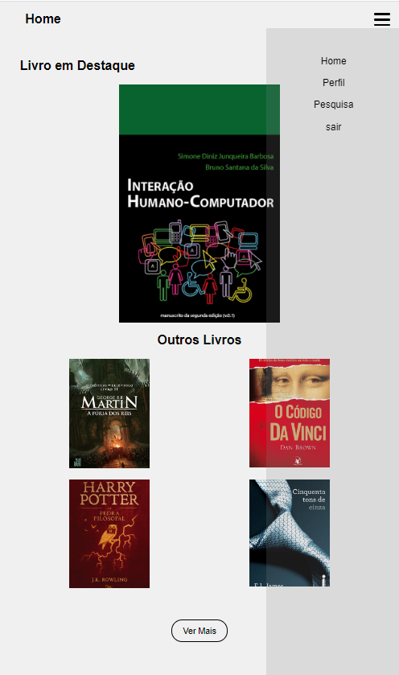

# Template Padrão da Aplicação

Pré-requisitos: <a href="2-Especificação do Projeto.md"> Especificação do Projeto</a>, <a href="3-Projeto de Interface.md"> Projeto de Interface</a>, <a href="4-Metodologia.md"> Metodologia</a>

Layout padrão da aplicação que será utilizado em todas as páginas com a definição de identidade visual, aspectos de responsividade e iconografia.

Projetado com simplicidade e elegância para apaixonados por leitura e amantes da literatura. Nosso objetivo é proporcionar uma experiência de compra/troca de livros fácil, intuitiva e agradável. Nosso template padrão simples e limpo oferece todas as ferramentas necessárias para explorar, escolher e adquirir os livros que você deseja com facilidade.

