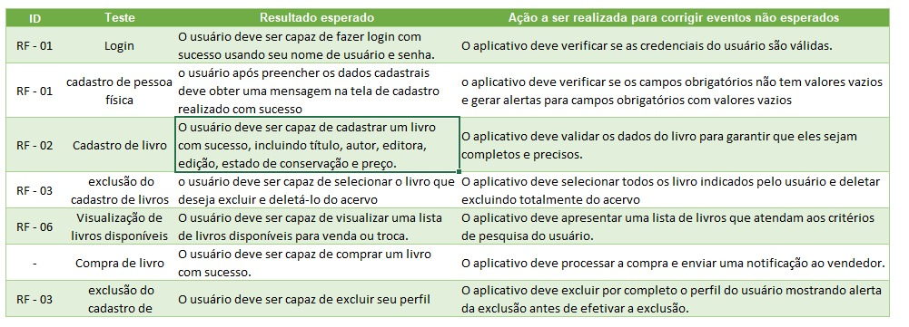

# Plano de Testes de Usabilidade

O teste de usabilidade permite avaliar a qualidade da interface com o usuário da aplicação interativa. O Plano de Testes de Software é gerado a partir da especificação do sistema e consiste em casos de testes que deverão ser executados quando a implementação estiver parcial ou totalmente pronta.

